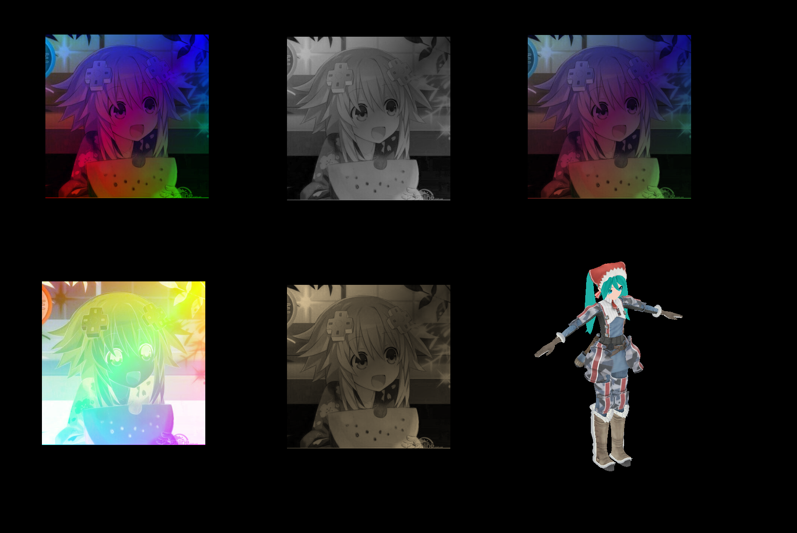

#计算机图形学实验代码及相关代码
----------
程序分为两部分，core为核心部分，实现对opengl的封装，提供一套较为直观的框架。<br>
src为主程序部分，所有实验具体实现代码都在这里。以core中的框架为基础实现。
<br>
<br>
#文件结构
<br>
```
project
│   build.gradle        //gradle脚本（自动配置环境）
│
└───core(module)        //绘图核心，实现对opengl的封装
│   │
│   └───java            //核心部分程序
│   │   │   geom            //基本几何体，实现对opengl绘图部分的封装
│   │   │   utils           //工具
│   │   │   view            //GUI组件实现
│   │
│   └───resources       //shader及资源文件
│
└───src(module)         //主程序模块及GUI
│   │
│   └───java            //绘制主程序
│        │   Main            //主类
│        │   ViewTest1       //实验1
│        │   ViewTest2       //实验2
└───imgs         //实验效果图片
```

#实验2
使用glsl语言编写了多个着色器<br>
效果图<br>
[](https://github.com/7eu7d7/cg_opengl/imgs/task2.png)
##使用的文件
* [主显示类](src/main/java/gl7e/ViewTest2.java)
* [矩形模型](src/main/resources/model2.xml)
  * [xml模型加载类](core/src/main/java/gl7ecore/geom/Model7e.java)
* [初音未来模型](src/main/resources/miku/miku.obj)
  * [obj模型加载类](core/src/main/java/gl7ecore/geom/ObjModel.java)